# Realtime Object Detection for Robotic Arm Applications

Welcome to the project on **Realtime Object Detection for Robotic Arm Applications**. This repository contains comprehensive documentation and code for implementing a robotic arm that can autonomously detect, classify, and pick up objects using advanced machine learning and reinforcement learning techniques. The project leverages Deep Q-Learning, object detection frameworks like Faster R-CNN, and neural network models to achieve high accuracy and efficiency in real-time applications.

## Contents

### 1. Deep Q-Learning
   - Overview of the Deep Q-Learning algorithm
   - Key concepts: Model-based learning, Off-policy learning, Temporal difference learning
   - Detailed algorithm steps and pseudo-code

### 2. Simulation Requirements and Setup
   - Setup instructions for Pybullet, an essential physics engine for simulation
   - Machine learning libraries: TensorFlow and PyTorch
   - Object detection libraries and their setup

### 3. Object Detection
   - Explanation of object detection and localization
   - Approaches: Non-neural and neural network-based methods
   - Focus on Faster R-CNN and its implementation
   - Real-time detection results and evaluation

### 4. LabelImg
   - Usage instructions for LabelImg, a tool for generating labeled datasets
   - Step-by-step guide to setting up and using LabelImg

### 5. Environment Setup
   - Detailed steps for setting up the simulation environment
   - Information on the articulated robot model (Kuka iiwa)
   - Description of inputs, outputs, and the reward scheme for reinforcement learning

### 6. Results and mAP Evaluation
   - mAP evaluation and

## 1. Robot Arm

Robotic arms are mechanical devices designed to mimic the functions of a human arm. They consist of multiple links connected via joints that provide restricted motion, which can be rotational or linear. The combination of different joint motions allows the arm a specific range of motion, known as the workspace of the robot manipulator. This structure is referred to as the kinematic chain of the robotic manipulator.

The end of the kinematic chain, where the working tool is attached, is called the end effector. The main goal is to control the real-world location of this end effector. The types of joints in relation to their axis of control, as described by the kinematic chain, include:

- **Cartesian**: Combines three prismatic joints (linear motion), allowing movement described in Cartesian coordinates.
- **Cylindrical**: A mix of rotating and prismatic joints, defining motion in cylindrical coordinates.
- **Polar**: Also known as spherical, it combines twisting and rotating joints to define motion in polar coordinates.
- **SCARA**: Selectively compliant arm for robotic assembly, consisting of two parallel joints, providing motion in a fixed plane.
- **Articulated**: Kinematic chain with multiple rotary joints (2 to 10), which presents a non-linear relationship between the manipulator’s position/orientation and the rotational angles of the joints.

### 1.1 Controlling of Articulated Robots - Inverse Kinematics

Controlling articulated robots involves managing the angle of each joint. The relationship between joint angles and the end effector's coordinates is derived using forward kinematics. To move the end effector from one point to another, inverse kinematics is required, establishing the inverse relationship. This concept allows for the manipulation of joint angles to achieve a desired position of the end effector.

For more details, refer to [MathWorks Inverse Kinematics](https://www.mathworks.com/discovery/inverse-kinematics.html).

## 2. Reinforcement Learning

Reinforcement learning is a method where robots learn behaviors through trial and error interactions with their environment. It is effective because it allows models to be trained without explicitly defining the model's complexities. This technique is similar to how humans learn and can solve problems unsolvable by conventional methods. Key concepts include:

### 2.1 Markov Property

A process follows the Markov property if the prediction of future states (or conditional probability) depends only on the present state, not past states. The present state must have all relevant information necessary for future predictions.

### 2.2 Markov Decision Process (MDP)

MDP describes an ideal system adhering to the Markov property, with a reward/punishment scheme for each action and a state transitioning scheme based on current state and action. The process involves distributions for rewards conditioned on actions and state transitions.

---

# Deep Q-Learning

Deep Q-Learning is an advanced reinforcement learning technique that builds on Q-Learning, integrating deep neural networks to optimize decision-making.

## Key Concepts

1. **Model-Based Learning:** The model predicts future states and learns the environment's behavior.
2. **Off-Policy Learning:** Learns from random actions (exploration) and balances exploration and exploitation.
3. **Temporal Difference Learning:** Uses bootstrapping to gather and learn from samples.

## Deep Q-Learning Algorithm

Here's a high-level overview of the Deep Q algorithm:

1. **Initialize Parameters:**
   - `decay = d`
   - `epsilon = e`
   - `Q network` with weights `w`

2. **Training Loop:**
   - For episodes = 1 to N:
     - Set current state `st`
     - Choose action `at`:
       - With probability `e`, choose a random action
       - Otherwise, `at = max(Q(st; a : weights))`
     - Get `Nextstate`, `reward`, `done` from environment
     - Store `(st, at, reward, Nextstate)`
     - Train `Q` network with samples `(st, at, reward, Nextstate)`
     - Decay `epsilon`

3. **Sample Training:**
   - For each sample:
     - Get sample `(ss, as, rewards, nextstates)`
     - Compute `y = reward + γ * max(Q1(ss, as : weights))`
     - Perform gradient descent `(y - Q(ss, as : weights))`

4. **Update Target Network:**
   - Every `c` steps, set `Q1(weights) = Q(weights)`

This algorithm ensures the model learns the optimal policy through both exploration and exploitation.

# Deep Q-Learning and Object Detection

## Deep Q-Learning

Deep Q-Learning is an advanced reinforcement learning technique that builds on Q-Learning, integrating deep neural networks to optimize decision-making.

### Key Concepts

1. **Model-Based Learning:** The model predicts future states and learns the environment's behavior.
2. **Off-Policy Learning:** Learns from random actions (exploration) and balances exploration and exploitation.
3. **Temporal Difference Learning:** Uses bootstrapping to gather and learn from samples.

### Deep Q-Learning Algorithm

Here's a high-level overview of the Deep Q algorithm:

1. **Initialize Parameters:**
   - `decay = d`
   - `epsilon = e`
   - `Q network` with weights `w`

2. **Training Loop:**
   - For episodes = 1 to N:
     - Set current state `st`
     - Choose action `at`:
       - With probability `e`, choose a random action
       - Otherwise, `at = max(Q(st; a : weights))`
     - Get `Nextstate`, `reward`, `done` from environment
     - Store `(st, at, reward, Nextstate)`
     - Train `Q` network with samples `(st, at, reward, Nextstate)`
     - Decay `epsilon`

3. **Sample Training:**
   - For each sample:
     - Get sample `(ss, as, rewards, nextstates)`
     - Compute `y = reward + γ * max(Q1(ss, as : weights))`
     - Perform gradient descent `(y - Q(ss, as : weights))`

4. **Update Target Network:**
   - Every `c` steps, set `Q1(weights) = Q(weights)`

This algorithm ensures the model learns the optimal policy through both exploration and exploitation.

## Limitations of Reinforcement Learning

Reinforcement Learning is effective for training an agent for a specific task. However, challenges arise with variations in tasks. Key limitations include:
- **Re-training Needs:** Each new task requires re-training and exploring new scenarios.
- **Reward Scheme:** Defining a new reward scheme for each task can be tedious and time-consuming.
- **Fixed Tasks:** More suitable for fixed tasks rather than dynamic or varied tasks.

Example: For an articulated robot, it's more practical to use reinforcement learning to teach it to reach and pick up an object, rather than sorting or arranging items.

## Object Detection

Object detection extends the concept of object classification by adding localization, which is crucial for many vision problems. It involves identifying and locating objects in an image.

### Approaches:
1. **Non-Neural Methods:**
   - Scale Invariant Feature Transform (SIFT)
   - Histogram of Oriented Gradients (HOG)

2. **Neural Network-Based Methods:**
   - **Region Methods:** (e.g., R-CNN, Faster R-CNN)
   - **Single Shot Object Detection (SSD)**
   - **You Look Only Once (YOLO)**

Advantages of Neural Network-Based Approaches:
- Flexibility to changes
- Can be trained on small datasets via transfer learning

### Focus on Faster R-CNN:
- **Regional Proposal Network:** Simultaneously classifies objects and predicts bounding regions.
- **Segmentation:** Segments images into regions of interest before classification.
- **Speed:** Faster than traditional methods but slower than the most recent YOLOv4.

## Faster R-CNN

### Backbone and Feature Extraction

The backbone of Faster R-CNN consists of feature extraction convolution layers based on deep neural networks such as ResNet. The project uses ResNet50 as its backbone, pre-trained on the COCO dataset.

#### ResNet

All classification and detection algorithms rely heavily on feature extraction from images. The universal approximation theorem suggests that any function can be approximated by a single feedforward layer, but shallow networks are prone to early saturation. Deeper networks extract better features but face the problem of vanishing gradients.

To address this, ResNet uses shortcut connections or identity shortcut connections. The input after activation, given by the function \( F(x) \), has shortcut connections that add \( x \) to the activated input, resulting in \( H(x) = F(x) + x \). During backpropagation, the gradient of \( H(x) \) maintains its identity value, preventing gradient loss and allowing deeper layers to learn useful features. This enables ResNet to extend its depth up to 152 layers. For this project, ResNet50 (with 50 layers) is used.

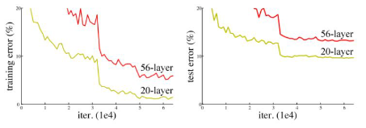

### Evaluation of Object Detection Models

In classification problems, a confusion matrix is used for evaluation. However, detection problems also involve localization, which needs to be evaluated using mean Average Precision (mAP). The Intersection over Union (IOU) metric calculates the precision of object detection algorithms. IOU is the ratio of the intersecting area of true and predicted ground boxes to the union area of both boxes. A confusion table with cumulative true positives, true negatives, false positives, and false negatives is used to get the precision-recall distribution. The area under this distribution gives the mAP evaluation.

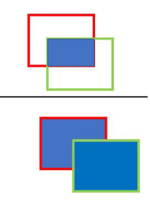

### Transfer Learning

Transfer Learning is a powerful technique that implements models trained for a certain task on different but similar tasks. For this project, a pre-trained Faster R-CNN model based on ResNet-50 with weights pre-trained on the COCO dataset (containing 330,000 images of 80 different classes) is used. Training this on a desktop with limited computing power would take several hours to a few days. However, using transfer learning, a small set of 40-50 images of a particular class can be used to selectively train the network within a few minutes. For this project, a set of 40 images each of rubber ducks and balls is used to detect these two classes, effectively reducing training time to a few minutes.

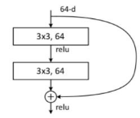

## References

- [Deep Q-Learning Explained](https://www.example.com)
- [Reinforcement Learning Techniques](https://www.example.com)
- [Faster R-CNN](https://arxiv.org/pdf/1512.03385v1)

Chapter 4

Implementation and Results

As stated earlier, this experiment is implemented in different pieces as components of a single pipeline, and so the the results are also discussed separately for each pipeline then whole system together.

1. Maneuvering with Reinforcement Learning

The firstpart of pipeline is training the articulated robot to maneuver itself and to reach the target object position. Following the algorithm [2.1] , a deep neural network (Q(s,a)) with following specificationsis modeled.

Table4.1: LayerarchitectureofDeepqnetworkused. UnliketraditionaltabularQlearning algorithm that uses table to capture environment model by keeping a record of every state and there corresponding action values , Deep Q network uses a deep neural network to approximate this table as a function mapping all uncountable states to there corresponding action values or Q values. The following net in simulation has 3 hidden layers with tanh activation

# Chapter 3: Simulation Requirements and Setup

## 1. Pybullet

Pybullet provides a clear and simple API for accessing the Bullet physics engine. It also offers guides for utilizing features of the Bullet engine. Pybullet allows users to load URDF files and supports formats from platforms like Gazebo SDF, MujoCo MJCF, along with tools such as inverse kinematic solvers and visualization tools. It also provides pre-existing models. Pybullet's cross-platform compatibility is an excellent advantage, and for this project, Windows is used.

### Pybullet Setup Steps:
1. **Install Python:** Ensure Python 2 or Python 3 is installed. Python 3.6 is preferred for this project.
2. **Install Pybullet:** Use the command `pip install pybullet` on a Python-enabled command shell.
3. **Access Examples and Models:**
   - Clone the repository from `https://github.com/bulletphysics/bullet3` or download the zip file.
   - Unzip in a suitable directory.
   - Existing models and examples can be found under the "pybullet_env" folder and "pybullet_data" folder.

## 2. Machine Learning Libraries

After setting up Pybullet for simulation, the next step is setting up Python libraries for machine learning algorithms.

### TensorFlow

TensorFlow is an open-source machine learning library that supports both CPU and GPU. For GPU support, CUDA must be installed from Nvidia's official source. TensorFlow 2.3 along with CUDA version 11.1 is used for this project. For installation and setup, refer to TensorFlow [documentation](https://www.tensorflow.org/).

### PyTorch

PyTorch is another open-source machine learning library, user-friendly for beginners. It is preferred for this project because it provides pre-trained models under the PyTorch Zoo collections. For installation and setup, refer to PyTorch [documentation](https://pytorch.org/).

## 3. Object Detection Libraries

Object detection requires additional setup beyond machine learning libraries. There are two main approaches to implement object detection.

### TensorFlow Object Detection API

Built on TensorFlow, this API simplifies the deployment of object detection modules and provides direct control over GPU usage. For setup and details, refer to the TensorFlow Object Detection API [documentation](https://www.tensorflow.org/lite/models/object_detection/overview).

### PyTorch Model Zoo

PyTorch provides access to the Model Zoo, a collection of pre-trained models ready for deployment or fine-tuning. It includes models for object recognition, detection, image translation, and more. For more details, refer to the PyTorch Model Zoo [documentation](https://pytorch.org/vision/stable/models.html).

## Detecto: Object Detection API for PyTorch

Detecto, built on PyTorch, offers easy access to training a custom object detector using ResNet-50 based Faster R-CNN. It includes wrapper functions from OpenCV for image and video visualization. To install Detecto, use the command `pip install detecto`. For further information, visit [Detecto Documentation](https://detecto.readthedocs.io/en/latest/).

# Chapter 3: Simulation Requirements and Setup

## 1. Pybullet

Pybullet provides a clear and simple API for accessing the Bullet physics engine. It also offers guides for utilizing features of the Bullet engine. Pybullet allows users to load URDF files and supports formats from platforms like Gazebo SDF, MujoCo MJCF, along with tools such as inverse kinematic solvers and visualization tools. It also provides pre-existing models. Pybullet's cross-platform compatibility is an excellent advantage, and for this project, Windows is used.

### Pybullet Setup Steps:
1. **Install Python:** Ensure Python 2 or Python 3 is installed. Python 3.6 is preferred for this project.
2. **Install Pybullet:** Use the command `pip install pybullet` on a Python-enabled command shell.
3. **Access Examples and Models:**
   - Clone the repository from `https://github.com/bulletphysics/bullet3` or download the zip file.
   - Unzip in a suitable directory.
   - Existing models and examples can be found under the "pybullet_env" folder and "pybullet_data" folder.

## 2. Machine Learning Libraries

After setting up Pybullet for simulation, the next step is setting up Python libraries for machine learning algorithms.

### TensorFlow

TensorFlow is an open-source machine learning library that supports both CPU and GPU. For GPU support, CUDA must be installed from Nvidia's official source. TensorFlow 2.3 along with CUDA version 11.1 is used for this project. For installation and setup, refer to TensorFlow [documentation](https://www.tensorflow.org/).

### PyTorch

PyTorch is another open-source machine learning library, user-friendly for beginners. It is preferred for this project because it provides pre-trained models under the PyTorch Zoo collections. For installation and setup, refer to PyTorch [documentation](https://pytorch.org/).

## 3. Object Detection Libraries

Object detection requires additional setup beyond machine learning libraries. There are two main approaches to implement object detection.

### TensorFlow Object Detection API

Built on TensorFlow, this API simplifies the deployment of object detection modules and provides direct control over GPU usage. For setup and details, refer to the TensorFlow Object Detection API [documentation](https://www.tensorflow.org/lite/models/object_detection/overview).

### PyTorch Model Zoo

PyTorch provides access to the Model Zoo, a collection of pre-trained models ready for deployment or fine-tuning. It includes models for object recognition, detection, image translation, and more. For more details, refer to the PyTorch Model Zoo [documentation](https://pytorch.org/vision/stable/models.html).

## Detecto: Object Detection API for PyTorch

Detecto, built on PyTorch, offers easy access to training a custom object detector using ResNet-50 based Faster R-CNN. It includes wrapper functions from OpenCV for image and video visualization. To install Detecto, use the command `pip install detecto`. For further information, visit [Detecto Documentation](https://detecto.readthedocs.io/en/latest/).

## 4. LabelImg

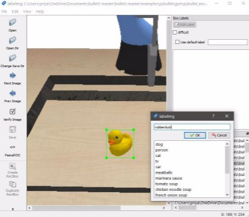

Figure 3.1: Software helps fast generating data for object detection algorithms. Open the directory with collection of images, mark the bounding box around the target object and label the object. This simple cycle generates a ".xml" file containing labels and XY coordinates of bounding boxes.

LabelImg is free to use software based on Python for generating samples for object detection and classification. It can generate labels in different formats suitable for different platforms. For the project, image samples for bounding box predictions were generated using LabelImg.

### LabelImg Setup Steps:
1. **Install LabelImg:** Use the command `pip install labelimg` on a Python-enabled command shell.
2. **Open LabelImg:** Open the directory with sample images.
3. **Set Save Directory:** Change the save directory to the same folder to save label files.
4. **Label Images:** Mark the bounding boxes around target objects and save the label file with `.xml` extension (can be changed as per requirement).

## 5. Setting Up Environment

With all libraries installed, this section details the steps to set up the simulation environment.

### Environment Setup Steps:

1. **Determine Task Type:** Decide whether the task is episodic (with an end state) or non-episodic (continuous).
2. **Load URDF Models:** Load models like Kuka iiwa, table, tray, toy duck, and ball in the Pybullet environment.
3. **Reset Function:** Implement a reset function to randomize joint positions and object locations and sizes.
4. **Define Inputs and Outputs:** Inputs will be defined in the next section. Outputs include state, reward, and termination flag. The state is based on criteria used for training (e.g., distance metrics or image-based states). Rewards are defined to reflect the task's goal. The termination flag indicates whether the end goal is achieved.

### Articulated Robot Model - Kuka iiwa

Kuka iiwa 7 is a model with 14 links and 7 joints (excluding the gripper joints). It uses inverse kinematics to calculate joint rotations. Selecting an effective step size is crucial for minimizing error while maintaining motion speed. For this project, a step size of 0.001 is used.

### Action Space Definition

The action space consists of continuous motions in Cartesian coordinates and rotations. For ease of use, it is reduced to 6 discrete actions: ["stop", "left", "right", "down", "forward", "backward", "up"].

### Episode and Step Information

Each episode consists of 50 steps, providing ample time for the arm to complete its tasks. Information on the end effector's orientation and position is provided by the forward kinematics function.

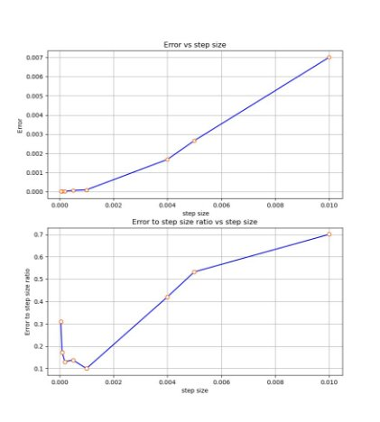

Figure 3.2: Selection of step size is crucial in reducing error. As the step size increases, the magnitude of error also increases, whereas the second graph shows the relative error size compared to step size. This is important as the accumulation of small errors can result in large errors. The step size with the smallest relative error is selected, which is step size 0.001.

After following all these steps, the environment is ready for training.

## Neural Network Architecture

|Layer|Nodes|Activation|
| - | - | - |
|input|2|linear|
|hidden|10|tanh|
|hidden|10|tanh|
|hidden|10|tanh|
|output|6|linear|

## Reward Scheme

The reward scheme is designed to reduce the distance between the end effector and the object.

|Algorithm 4.1: Environment Reward Scheme|
| - |
|1. `dt0 = distance before action`|
|2. `dt1 = distance after action`|
|3. `if dt1 < dt0 reward = 0.1 + exp`|

## mAP Evaluation

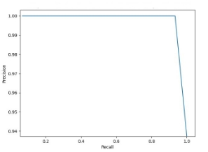

Figure 4.7: mAP estimation given by area under precision-recall curve, mAP = 0.963, IOU > 0.8

### Confusion Matrix for Toy Duck and Ball

|       | True Positive (TP) | False Negative (FN) | True Negative (TN) | False Positive (FP) |
|-------|---------------------|---------------------|---------------------|---------------------|
| Duck  | 17                  | 0                   | 19                  | 0                   |
| Ball  | 19                  | 0                   | 17                  | 1                   |

An mAP evaluation of 0.96 for an IOU of 0.8 is a good score, although it's based on a small test dataset of 30 images. The average detection speed is 0.27 ms. The following plots show mAP estimations for different IOUs, useful for characterizing the detection algorithm when comparing with other models.

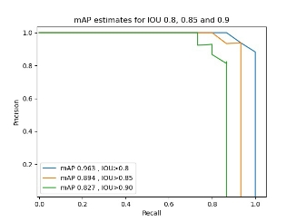

Figure 4.8: mAP estimates help evaluate different models for the same IOU curves. The closer the curve area is to 1, the better the detection algorithm.

### Real-Time Detection Results

Below images show detection results on clustered objects.

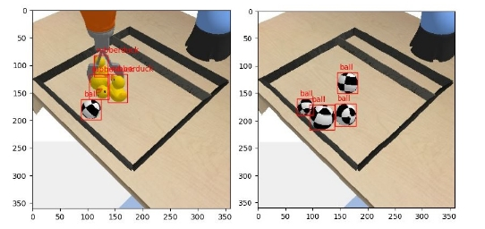

Figure 4.9: Real-time detection on two instances, with objects clustered together and occlusion created by the gripper. The detector classifies objects with classification probability threshold > 0.95 and IOU threshold > 0.8.

## Object Position Determination

Output coordinates from the detection module are used as input to a feed-forward neural network with Mean Squared Error (MSE) loss function. A dataset of 4000 points is generated using the object detection algorithm to get 

\[X(upper left), Y(upper left), X(lower right), Y(lower right)\]

 as inputs and object true 

\[X, Y\]

 coordinates as targets. The model predicts the object's 

\[X, Y\]

 coordinates using these inputs.

### Model Architecture

|Layer|Nodes|Activation|
| - | - | - |
|input|4|linear|
|hidden|6|relu|
|hidden|10|relu|
|output|2|linear|

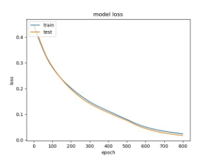

Figure 4.10: Validation loss approaches 0.0132 and test loss approaches 0.0107, with train, test, and validation split of 0.4, 0.4, 0.2 respectively.

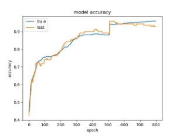

Figure 4.11: Validation accuracy approaches 0.983 and test accuracy approaches 0.937, with train, test, and validation split of 0.4, 0.4, 0.2 respectively.

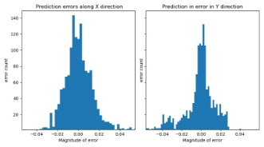

Figure 4.12: Distribution showing the degree of deviations of 1600 points. Majority of error is within the magnitude of 0.02 units.

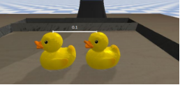

Figure 4.13: An idea of sizes in simulation.

## Results of Complete Pipeline

Output X, Y coordinates are fed to the neural network to complete the pipeline. The model successfully picks objects 85 out of 100 times. The results are impacted by the position prediction model's error. 

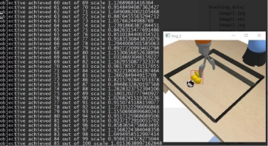

Figure 4.14: Number of episodes where the goal is achieved corresponding to total episodes and size of the targeted object. 85 out of 100 times the articulated arm was able to pick up the detected object, with an average step time of 3.337 ms.

The results show a successful detection and picking rate that can be further improved to increase efficiency and reaction time of the articulated robot, aiming for a detection and picking accuracy above 85%.

# Chapter 5: Conclusion and Future Scope

## 1. Conclusion
1. **Performance:** The current model is capable of selecting and picking up an object convincingly. Although the process is slow, the approach shows promising results. The model is far from perfect and lacks human dexterity, but it shows potential for improvement.
2. **Deep-Q Learning:** Using Deep-Q learning with distance as the sole training metric yields good results. However, the model struggles with determining the orientation of the selected object, compromising the gripping action. The orientation of the end effector must also be considered for a better grip.
3. **Inverse Kinematics:** The current model uses open-loop inverse kinematics, resulting in small step sizes and slow single steps. More efficient control schemes are needed. Alternatively, directly training a reinforcement learning model using joint states could eliminate the problem of step size and speed up the process. The current predefined action space does not include changing the orientation of the end effector, fixing its orientation.
4. **Orientation Consideration:** A new approach considering the orientations of both the end effector and the object is needed. While the top-down approach works well for the simulated objects, it fails with flat or elongated objects like books, plates, pencils, or pipes that require a specific orientation of the end effector.

   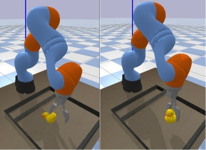
   
   Figure 5.1: Direction of approach is always fixed (from top), irrespective of the object's orientation. This causes issues with objects having varying dimensions, such as rods or flat objects like plates or pans.
   
5. **Object Detection and Classification:** Despite promising mAP evaluation on a small dataset, a faster approach is required. The current model using Faster R-CNN takes approximately 300 ms for object detection, which is about 20 times slower than state-of-the-art algorithms like YOLOv4 and SSD MobileNet.
6. **Robust Mapping Scheme:** A more robust box-to-position mapping scheme is needed, as the current method highly relies on camera orientation, reducing ease of reusability in different setups.
7. **Object Tracking:** The model heavily relies on distance as the metric for object selection. While it can categorize different classes of objects, it fails to differentiate between identical objects of the same class. It also lacks object tagging across image frames, treating each image as a new set of objects.

   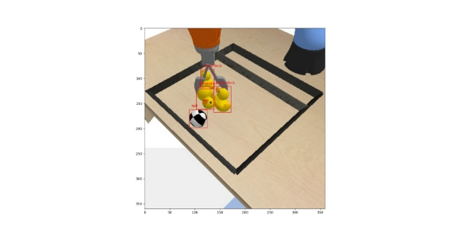
   
   Figure 5.2: End effector always approaches from the top direction, irrespective of the object's pose and orientation.

## 2. Future Work
1. **Increasing Model Speed:** Enhancing the speed of the model, both in terms of step size and Faster R-CNN prediction time, is crucial. Using joint positions as input to the reinforcement model instead of step-dependent action space appears promising and needs to be explored and tested.
2. **Implementing State-of-the-Art Algorithms:** Testing current state-of-the-art object detection algorithms like YOLOv4 and SSD networks is necessary. These algorithms are expected to work at least ten times faster than the current detection speed, directly aiding the robot's reaction time.
3. **Pose and Orientation Estimation:** Incorporating pose estimation algorithms will increase the diversity of objects the model can handle.
4. **Object Detection and Tracking:** Immediate attention is needed for implementing state-of-the-art object detection and tracking algorithms. The ROLO (Recurrent YOLO) algorithm, which uses LSTM to exploit temporal relations between successive image frames for object tracking, is a prominent idea. This approach should be tested and implemented to eliminate the issue of identical objects and object tagging.

## Bibliography

1. Priyanshu0402, “Priyanshu0402/realtime-object-detection-for-robotic-armapplications.” [Online]. Available: [https://github.com/Priyanshu0402/Realtime-Object-Detection-for-Robotic-ArmApplications](https://github.com/Priyanshu0402/Realtime-Object-Detection-for-Robotic-ArmApplications)
2. S. H. Burton, “Coping with the curse of dimensionality by combining linear programming and reinforcement learning.” [Online]. Available: [https://digitalcommons.usu.edu/etd/559/](https://digitalcommons.usu.edu/etd/559/)
3. W. Liu, D. Anguelov, D. Erhan, C. Szegedy, S. Reed, C.-Y. Fu, and A. C. Berg, “SSD: Single Shot Multibox Detector,” Lecture Notes in Computer Science, p. 21–37, 2016. [Online]. Available: [http://dx.doi.org/10.1007/978-3-319-46448-0_2](http://dx.doi.org/10.1007/978-3-319-46448-0_2)
4. J.-a. Kim, J.-Y. Sung, and S.-h. Park, “Comparison of Faster-RCNN, YOLO, and SSD for Real-Time Vehicle Type Recognition,” in 2020 IEEE International Conference on Consumer Electronics - Asia (ICCE-Asia), 2020, pp. 1–4.
5. K. He, X. Zhang, S. Ren, and J. Sun, “Deep Residual Learning for Image Recognition,” 2015.
6. UserManual.wiki, “Pybullet Quickstart Guide.” [Online]. Available: [https://usermanual.wiki/Document/pybullet20quickstart20guide.479068914/html](https://usermanual.wiki/Document/pybullet20quickstart20guide.479068914/html)
7. “GPU Support: TensorFlow.” [Online]. Available: [https://www.tensorflow.org/install/gpu](https://www.tensorflow.org/install/gpu)
8. PyTorch. [Online]. Available: [https://pytorch.org/](https://pytorch.org/)
9. “TensorFlow 2 Object Detection API Tutorial.” [Online]. Available: [https://tensorflow-object-detection-api-tutorial.readthedocs.io/en/latest/](https://tensorflow-object-detection-api-tutorial.readthedocs.io/en/latest/)
10. Model Zoo. [Online]. Available: [https://modelzoo.co/](https://modelzoo.co/)
11. “Welcome to Detecto’s Documentation!” [Online]. Available: [https://detecto.readthedocs.io/en/latest/](https://detecto.readthedocs.io/en/latest/)

