##Realtime Object Detection for Robotic Arm

#Applications

A project report submitted

in partial fulfillmentfor the award of the degree of

Bachelor of Technology

in

Avionics

by

Priyanshu Jain

Department of Electronics And Communication Engineering Indian Institute of Space Science and Technology
Thiruvananthapuram, India

May 2021

Certificate

This is to certify that the project report titled Realtime Object Detection for Robotic Arm Applications submitted by Priyanshu Jain, to the Indian Institute of Space Science and Technology, Thiruvananthapuram, in partial fulfillment for the award of the degree of Bachelor of Technology in Avionics is a bona fide record of the original work carried out by him/her under my supervision. The contents of this project report, in full or in parts, have not been submitted to any other Institute or University for the award of any degree or diploma.

Dr. Deepak Mishra Dr. Deepak Mishra

Professor and Head of Avionics Department Professor and Head of Avionics Department

Place: Thiruvananthapuram Date: May 2021

i

Declaration

I declare that this project report titled Realtime Object Detection for Robotic Arm Appli- cations submitted in partial fulfillment for the award of the degree of Bachelor of Tech- nology in Avionics is a record of the original work carried out by me under the supervision of Dr. Deepak Mishra, and has not formed the basis for the award of any degree, diploma, associateship, fellowship, or other titles in this or any other Institution or University of higher learning. In keeping with the ethical practice in reporting scientificinformation, due acknowledgments have been made wherever the findingsof others have been cited.

Place: Thiruvananthapuram Priyanshu Jain Date: May 2021 (SC17B113)

iii

Acknowledgements

I would like to express my sincere gratitude to Dr. Deepak Mishra for his invaluable guid- ance in the fieldof Deep learning and Computer Vision. His insight helped clarify any and every aspect of this project.

My initial lack of background knowledge in this field was quickly mitigated by his timely guidance and constant supervision. His insight into field have been cultivating me for over past two years, guiding and nurturing me in this vast fieldof deep learning. For his ever-present guidance throughout the duration of this project, I sincerely thank him. ...

Priyanshu Jain

v

Abstract

With ever evolving world of automation, robots are being deployed to replace any and all manual tasks, saving time and resources. Automation has seen a whole new dimension with introduction of computer vision. Vision has added a new sense to automation industry, aided by deep neural networks have given rise more humane capabilities of recognition and detection.

Keeping this in mind , the project aims at training an articulated robot to perform most rudimentary task of detecting , selecting and picking up objects. This is the single basic task common to all processes dealing with distribution or arrangement of objects. The project discusses implementation of pure reinforcement based method and switching to reinforcement combined with vision based approach. The report gives a brief discussion on various fundamentals that are involvement in completing the pipeline for object detec- tion for robotic arm applications. In the end a working pipeline is presented for use. All implementations and simulations can be found in a GitHub [repository\[1\]](#_page57_x0.00_y792.00)

vii

Contents

[List of Figures](#_page12_x0.00_y792.00) xi [List of Tables](#_page14_x0.00_y792.00) xiii [List of Algorithms](#_page16_x0.00_y792.00) xv [Abbreviations](#_page18_x0.00_y792.00) xvii [1 Introduction](#_page20_x0.00_y792.00) 1

1. [Objective](#_page21_x0.00_y792.00) . . . . . . . . . . . . . . . . . . . . . . . . . . . . . . . . . . . 2
1. [Design Overview](#_page21_x0.00_y792.00) . . . . . . . . . . . . . . . . . . . . . . . . . . . . . . . 2
1. [Key contributions](#_page22_x0.00_y792.00) . . . . . . . . . . . . . . . . . . . . . . . . . . . . . . . 3
1. [Achievements](#_page22_x0.00_y792.00) . . . . . . . . . . . . . . . . . . . . . . . . . . . . . . . . . 3
1. [Report organisation](#_page23_x0.00_y792.00) . . . . . . . . . . . . . . . . . . . . . . . . . . . . . . 4

[2 Literature Review](#_page24_x0.00_y792.00) 5

1. [Robot arm](#_page24_x0.00_y792.00) . . . . . . . . . . . . . . . . . . . . . . . . . . . . . . . . . . . 5
1. [Reinforcement Learning](#_page26_x0.00_y792.00) . . . . . . . . . . . . . . . . . . . . . . . . . . . 7
1. [Object detection ](#_page29_x0.00_y792.00). . . . . . . . . . . . . . . . . . . . . . . . . . . . . . . . 10

[3 Simulation Requirements and Setup](#_page36_x0.00_y792.00) 17

1. [Pybullet](#_page36_x0.00_y792.00) . . . . . . . . . . . . . . . . . . . . . . . . . . . . . . . . . . . . 17
1. [Machine learning libraries](#_page37_x0.00_y792.00) . . . . . . . . . . . . . . . . . . . . . . . . . . 18
1. [Object detection Libraries ](#_page37_x0.00_y792.00). . . . . . . . . . . . . . . . . . . . . . . . . . . 18
1. [LabelImg](#_page38_x0.00_y792.00) . . . . . . . . . . . . . . . . . . . . . . . . . . . . . . . . . . . 19
1. [Setting up environment](#_page39_x0.00_y792.00) . . . . . . . . . . . . . . . . . . . . . . . . . . . . 20

[4 Implementation and Results](#_page43_x0.00_y792.00) 24

1. [Maneuvering with Reinforcement Learning](#_page43_x0.00_y792.00) . . . . . . . . . . . . . . . . . 24
1. [Object detection ](#_page47_x0.00_y792.00). . . . . . . . . . . . . . . . . . . . . . . . . . . . . . . . 28
1. [Object Position determination](#_page49_x0.00_y792.00) . . . . . . . . . . . . . . . . . . . . . . . . 30
1. [Results of Complete pipeline](#_page52_x0.00_y792.00) . . . . . . . . . . . . . . . . . . . . . . . . . 33

[5 Conclusion and Future scope](#_page53_x0.00_y792.00) 34

1. [Conclusion](#_page53_x0.00_y792.00) . . . . . . . . . . . . . . . . . . . . . . . . . . . . . . . . . . 34
1. [Future Work](#_page55_x0.00_y792.00) . . . . . . . . . . . . . . . . . . . . . . . . . . . . . . . . . . 36

[Bibliography](#_page56_x0.00_y792.00) 37 [Appendices](#_page60_x0.00_y792.00) 41

[A Appendix A Title](#_page60_x0.00_y792.00) 41

[A.1 Object detection , detecto API implementation ](#_page60_x0.00_y792.00). . . . . . . . . . . . . . . 41 [A.2 Position detection model implementation](#_page62_x0.00_y792.00) . . . . . . . . . . . . . . . . . . 43

List of Figures

1. [Function of entire pipeline](#_page21_x0.00_y792.00) . . . . . . . . . . . . . . . . . . . . . . . . . . 2
1. [Replaced sections of pipeline](#_page22_x0.00_y792.00) . . . . . . . . . . . . . . . . . . . . . . . . . 3
1. [Differnt types of robotic manipulators](#_page25_x0.00_y792.00) . . . . . . . . . . . . . . . . . . . . 6
1. [Inverse Kinematics](#_page26_x0.00_y792.00) . . . . . . . . . . . . . . . . . . . . . . . . . . . . . . 7
1. [Reinforcement Learning , Markov decision process](#_page27_x0.00_y792.00) . . . . . . . . . . . . . 8
1. [comparison between YOLO , SSD , faster R-CNN ](#_page30_x0.00_y792.00). . . . . . . . . . . . . . 11
1. [Region proposal - RCNN, only bounded regions are used for classification](#_page31_x0.00_y792.00) . 12
1. [Faster RCNN pipeline ](#_page32_x0.00_y792.00). . . . . . . . . . . . . . . . . . . . . . . . . . . . . 13
1. [Error increment with depth ](#_page33_x0.00_y792.00). . . . . . . . . . . . . . . . . . . . . . . . . . 14
1. [Shortcut Connections](#_page33_x0.00_y792.00) . . . . . . . . . . . . . . . . . . . . . . . . . . . . . 14
1. [IOU or Intersection over Union of two boxes is a method to calculate pre- cision of object detection algorithms. Red being predicted box and green being true bounding box. Area common to both is termed as intersection](#_page34_x0.00_y792.00)

   [and total area covered by overlapped boxes is termed as union , there ra-](#_page34_x0.00_y792.00)

   [tio, is used as grading metric for detection algorithms. With IOU being 1 means 100 percent detection precision ](#_page34_x0.00_y792.00). . . . . . . . . . . . . . . . . . . . 15

1. [LabelImg interface](#_page38_x0.00_y792.00) . . . . . . . . . . . . . . . . . . . . . . . . . . . . . . 19
1. [Error per step motion](#_page41_x0.00_y792.00) . . . . . . . . . . . . . . . . . . . . . . . . . . . . . 22
1. [Loss and episode rewards per episode](#_page44_x0.00_y792.00) . . . . . . . . . . . . . . . . . . . . 25
1. [A still from simulation results of firstpart of pipeline](#_page45_x0.00_y792.00) . . . . . . . . . . . . 26
1. [fails to pickup plate ](#_page46_x0.00_y792.00). . . . . . . . . . . . . . . . . . . . . . . . . . . . . . 27
1. [Easily picks up duck ](#_page46_x0.00_y792.00). . . . . . . . . . . . . . . . . . . . . . . . . . . . . 27
1. [fails to pickup pan ](#_page47_x0.00_y792.00). . . . . . . . . . . . . . . . . . . . . . . . . . . . . . 28
1. [Validation Loss during transfeer learning ](#_page48_x0.00_y792.00). . . . . . . . . . . . . . . . . . 29
7. [mAP estimation given by area under precision, recall curve , mAP = 0.963](#_page48_x0.00_y792.00)

   [, IOU > 0.8 ](#_page48_x0.00_y792.00). . . . . . . . . . . . . . . . . . . . . . . . . . . . . . . . . . 29

8. [mAP estimation given by area under precision, recall curve](#_page49_x0.00_y792.00) . . . . . . . . . 30
8. [Real time detection on two instances](#_page49_x0.00_y792.00) . . . . . . . . . . . . . . . . . . . . . 30
8. [Model Loss](#_page50_x0.00_y792.00) . . . . . . . . . . . . . . . . . . . . . . . . . . . . . . . . . . 31
8. [Model accuracy](#_page51_x0.00_y792.00) . . . . . . . . . . . . . . . . . . . . . . . . . . . . . . . . 32
8. [error magnitudes in X and Y directions ](#_page51_x0.00_y792.00). . . . . . . . . . . . . . . . . . . . 32
8. [An idea of sizes in simulation ](#_page52_x0.00_y792.00). . . . . . . . . . . . . . . . . . . . . . . . 33
8. [A still from simulation of complete pipeline](#_page52_x0.00_y792.00) . . . . . . . . . . . . . . . . . 33
1. [Direction of approach is always fixed ](#_page54_x0.00_y792.00). . . . . . . . . . . . . . . . . . . . . 35
1. [End effector always approaches from top direction , irrespective of pose](#_page55_x0.00_y792.00)

   [and orientation of object.](#_page55_x0.00_y792.00) . . . . . . . . . . . . . . . . . . . . . . . . . . . 36

xi

List of Tables

1. [Deep Q network ](#_page43_x0.00_y792.00). . . . . . . . . . . . . . . . . . . . . . . . . . . . . . . . 24
1. [Gripping efficiency on various objects](#_page45_x0.00_y792.00) . . . . . . . . . . . . . . . . . . . . 26
1. [Position determination network architecture](#_page50_x0.00_y792.00) . . . . . . . . . . . . . . . . . 31

xiii

List of Algorithms

[2.1 Deep Q Algorithm pseudo code ](#_page29_x0.00_y792.00). . . . . . . . . . . . . . . . . . . . . . . . 10

[4.1 Environment Reward scheme ](#_page44_x0.00_y792.00). . . . . . . . . . . . . . . . . . . . . . . . . 25

xv

Abbreviations

Q learning Quality learning

FDN Feed forward Network

URDF UnifiedRobotic Description Format

SDF Simulation Description Format

RCNN Region Based Convolutional Neural Networks mAP mean Average Precision

IOU Intersection over Union

SSD Single Shot detector

YOLO You Look Only Once

xvii

Chapter 1

Introduction

There are different types of robots available to replace humans for performing repetitive and exhausting tasks of sorting , arranging , tossing , separating and so as such. One example of such robots is articulated robots. Articulated robots are robots that have limbs with rotating joints , common example being robotic arms. Once used in large industrial operations and automotive industries , they have evolved to fit in smaller spaces and have gained higher precision. There applications have spread from being used in space stations to being used in labs for repetitive but precise tasks to being used on personal desks for picking and placing objects. A robotic arm can be viewed as a set of links connected and controlled by rotating joints. The rotating joints allow control of a robot for performing robust tasks of arranging, separating or sorting. But giving manual hard coded instructions toarobotcanbetedioustaskandispronetoerrors. Introductionofvisioninroboticsadded a new dimension of possibilities. Vision based control uses images as input feedback to the system, that can be processed to acquire relevant information. Using vision to perform a particular task is a challenging task. Using image feed backs and deploying self learning to reduce error and learn from is one idea that’s been followed recently. Such a concept gave rise to reinforcement learning. Though effective , reinforcement is data hungry process and training for complex tasks requires lots of data. And this is affected by curse of real world data, where hardware is expensive and suffer wear and tear from errors necessary for learning.

The project discusses an approach to incorporate reinforcement learning with real time object detection for robotic arm applications.

1. Objective

This project aims at using such vision inputs for assisting a robot arm in a simulated en- vironment to detect object, plan its movement and pick up the object. A robot articulated arm , model (KUKA iiwa 7) is used for simulation purposes, with a gripping end effector. For setting up simulation environment Pybullet ( Bullet physics engine) , is used. Explor- ing suitable methods for attaining the said end result. The major components of pipeline involves , training the articulated robot to pickup objects based on position. Next compo- nent is setting up a model to detect and select the required object from work space. Third component involves using the detection of object , providing the position of the object in the workspace. Combine the three components to achieve the rudimentary task of picking up a selected object.

2. Design Overview

Work is divided into two major objectives.

1. First major objective is to train the agent , that is the articulated robot arm to pickup objects , based on object positions as only input. The agent learns using Deep-Q learning algorithm.

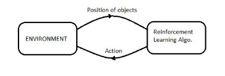

Figure 1.1: True coordinates from simulation environment are obtained and used to train The agent. First objective is to train the agent using the X,Y coordinates to maneuver in its work space

2. Replacing the true position by detecting objects and determining position.
1) Implementing an object detection scheme.
1) Predicting position of object based on detection.
3. Testing efficiency of entire pipeline, and robustness of implemented schemes.

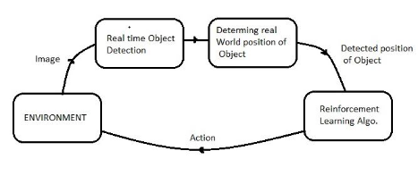

Figure 1.2: Second objective involves replacing the object positions obtained from envi- ronmentwithanobjectdetectionandlocalisationalgorithm. Thiswillhelpinextendingthe agent to real world scenario , where only input is visual images. This replacement requires further two components , first object classification and localisation scheme , second using these localisation bounding boxes(it is a rectangular box around located object and that is in image pixel coordinates) and convert it to real world coordinates, which can replace the position coordinates obtained from simulation environment

3. Key contributions
   1. Utilizing goal oriented nature of reinforcement learning algorithms combined with object detection capabilities in order to increase adaptability of articulated robot by training it to perform most rudimentary tasks that can be extended to task of complex nature.
   1. Implementation of a supervised learning algorithm , for obtaining positions of de- tected objects in an image image.
   1. Setting up a custom environment for training and testing purposes of an articulated robot arm, that can be reused for further extension on the said concept. Source files can be found on GitHub directory [,\[1\].](#_page57_x0.00_y792.00)
4. Achievements
1. Successful completion of reinforcement based maneuvering of robot.
1. Successful deployment of object detection mechanism on objects of choice.
1. Successful implementation of position determination algorithm.
4. Testing the efficiency of entire pipeline.
4. A thorough study of possible loop holes and scopes of improvement.
5. Report organisation
1. Chapter 2 discusses on various fundamentals necessary for implementing the entire pipeline. A discussion on different robotic arms, method of control a a brief back- ground of reinforcement learning, introduction to object detection schemes.
1. Chapter 3 Will give an idea on setting up simulation environment. Various soft wares and libraries required for running simulations.
1. Chapter4discussesimplementationandresultsofvariouspartsofpipelinesandthere evaluations.
1. Reportconcludeswithchapter5, providingwithvariousscopesofimprovementsand future work.

Chapter 2

Literature Review

1. Robot arm

Robotic arms are mechanical arms designed to mimic functions of human arm or try to perform similar functions. The arms consists of multiple links connected to each other via joints that provide a restricted motion to the entire structure , it can be either rotational motion or linear motion (transnational motion). These combinations of different motions at different joints provide a certain range of motion for entire arm that is termed as workspace of the robot manipulator. These links and joints together form , what is known as kinematic chain of the robotic manipulator.

The terminal of a kinematic chain is termed as a end effector. It is the end effector where the working tool is attached for performing a task , the tool can be anything from a gripping claw to a drill. Controlling or manipulating the real world location of this end effector is the end goal.

Based on types of joints in regards to axis of control in other terms the mathematical model of motion as described by the kinematic chain are :

1. Cartesian :combination of three prismatic joints (joints for linear motion ) allow a motion that can be described in Cartesian coordinate frame.
1. Cylindrical : combination of rotating and prismatic joint (for linear motion) allow to definemotion in cylindrical coordinates.
1. Polar : also called spherical configuration , combination of twisting and rotating joints allow to definemotion in polar coordinate frame.
1. SCARA : Selectively compliant arm for robotic assembly , these consists of two parallel joints , providing motion in a fixed plane.

   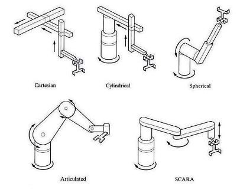

Figure 2.1: Different types of robot arms based on joint motion. Different types of joints provide different mathematical model of motion. For example rotating joints provide cir- cular motion in a 2d plane perpendicular to axis of joints , prismatic joints provide linear motion, twisting joints provide motion parallel to joint axis. Combining different such joints results in a complex 3D motion mathematical model that can be used to control a robotic manipulator.

5. Articulated : kinematics chain consists of several rotatory joints , ranging from 2 to 10. From control perspective, these robots have inherent problem of nonlinear relation between the position and orientation of the robot manipulator and rotational angles of the joints.

2\.1.1 Controlling of articulated robots - Inverse Kinematics

Articulatedrobotsrequirecontrollingangleofindividualjoint, sorelationbetweenangular positions of each joint and coordinates of end effector is derived using forward kinematics. But in order to translate end effector from one point to another in coordinate plane , we require inverse relation. This is achieved by inverse kinematics. As name states inverse kinematics is opposite of forward kinematics. Derivation of relation between joint angles and coordinates is out of scope of this report , as inbuilt library was used designed to run specific model of articulated robot used for simulation purposes. For more details[ refer mathwork inverse kinematic](https://www.mathworks.com/discovery/inverse-kinematics.html)

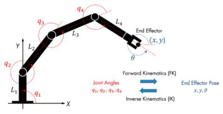

Figure 2.2: With multiple links and joints, given a set of joint positions , Forward Kine- matic approach helps in determining the position and orientation of end effector in Carte- sian coordinate frame. Whereas given position in Cartesian frame , to determine position of individual joint , inverse kinematics is used, that can be extended to determine change in joint positions subjected to change in Cartesian frame, forming basis for controlling articulated robots

2. Reinforcement Learning

"Learning from interaction is a foundational idea underlying nearly all theories of learning and intelligence."(Sutton and Barto , 1992)

Reinforcement learning is widely used in robotics, where robots can learn certain be- haviours through trial and error interactions with the environment. The approach is con- sidered effective as it allows the model to be trained , without defining complexities of model , which may or may not be possible at times. These techniques are very similar to how humans learn. It can be used to solve problems that cannot be solved by conventional methods. To get more idea on where and how these techniques are implemented in model , there are certain fundamentals that need to be cleared.

1. Markov Property

There are a few way to get the idea of a Markov property. It is to be understood that it is used to describe a stochastic or random process. If a random process has a property that a prediction of future state or conditional probability of future states, depend only on present state, the random process is said to follow Markov property. It is important to note that, dependence is only on present state , not on past states that have taken place.

OtherwayofunderstandingMarkovpropertyis, sayforpredictionofnextstateorforin order to obtain conditional probability distribution of future state, The present state should have all the relevant information required. Or if only information obtained from present state are necessary to obtain predictions for future state, then the process follows Markov property.

2. Markov Decision Process

Markov Decision Process is the foundation concept of reinforcement learning.

It is a way of describing an ideal system that follows Markov property. The process is

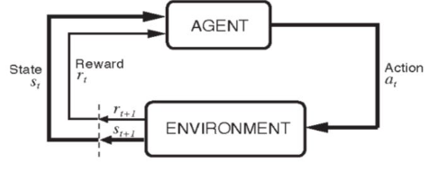

Figure 2.3: Interaction of Environment and Agent generates rewards and the this experi- ence trains the agent to learn.

said to be Markov Decision Process, if it follows Markov property, it has a scheme for rewarding or punishing for every action that takes place, and a state transitioning scheme based on current state and action, in other sense it has distribution for rewards conditioned on action and state transitions Ra (s;s0) and another distribution for next state transition conditioned on action and function of current stateP (s;s0). And both these functions

a

depend on actions definedby decision maker or an action policy. The whole setup makes a Markov decision Process.

3. Deep-Q Network

Deep q learning is a reinforcement learning approach and is extension of Q learning or Quality learning method. To classify deep q learning , it is a model based , off-policy value based , temporal difference learning method. A brief description of these terms is provided in proceeding lines. First there is a need to understand some ideas used in reinforcement

learning. As described in above section , policy is action selection scheme of the model. If actions are selected directly based on probabilities of actions , that is , there is direct relation between state and action than it is termed as on policy based network. A policy based network avoids learning from exploration , that is , random action and is termed as estimation policy or greedy policy or exploitation policy .Where as in an off-policy model, algorithm tends to learn by randomly taking actions (termed as exploration policy) within a state or defining a policy that balances between exploitation and exploration character- istics called behaviour policy. Deep Q is off-policy learning algorithm , because it uses something called value based learning. For every state, a q-learning model ,tends to assign action values that is learned on basis of rewards received by every action for that particular state. To learn the q-values for every action for a state , Q-learning depends heavily on exploration. Q-learning uses both exploitation and exploration policies , thus making it off-policy approach.

An approach is called model based when the current model tries to predict outcome of future state. That is, the model tends to learn behaviour of environment. If a model learns behaviour of environment and utilises predictions, then the approach is called model based learning. Q learning is a model based learning algorithms , because it relies on predictions for rewards received in a future state. This idea leads to another term temporal differ- ence learning. The relation will be made obvious in proceeding lines.Temporal difference method is an sample gathering approach to determine characteristics of a distribution or process by using bootstrapping. Bootstrapping is a statistical approach for generating new samples by sampling already existing samples. Deep-q learning stores samples from envi- ronment, that is, state, action takes and reward received. Using exploration and exploitation policies, these stored states are samples generated when model policy takes an action cor- responding to a state, and policy itself learns from these stored samples. Thus making it a temporal difference learning.

So it can be seen that how the above terms explain working of a Deep-q algorithm in a single line. Only thing that remains is update method. How exploitation policy is updated. Exploitation or greedy policies are updated based on something called value function, or in case of deep-q learning , action value function. This action value function is definedusing bellman equation.

Algorithm 2.1: Deep Q Algorithm pseudo code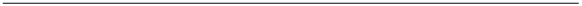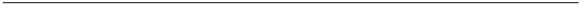

1 decay = d

2 epsilon = e

3 Q network with weights w

4 for episodes=1:N do

5  current state = st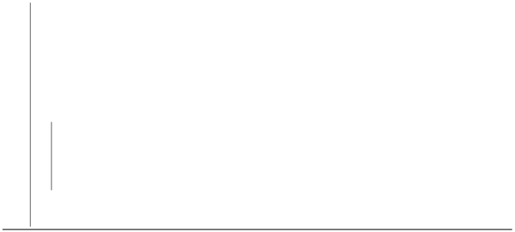
5  With probability e choose random action at
5  otherwise action at = max(Q(st;a : weights))
5  Nextstate , reward , done = ENV(at)
5  store(st , at , reward , Nextstate)
5  train Q(w:sample(st , at , reward , Nextstate))
5  epsilon = epsilon\*decay for 1:Sample Sizedo

12 ss;as;rewards;nextstates = sample()

13 y = reward + l\*max(Q1(ss;as : weights))

14 perform gradient (y - Q(ss;as : weights))

15 every c step set Q1(weights) = Q(weights)end 16 end

17

4. Limitations of Reinforcement Learning

Reinforcement Learning is a very good technique for training an agent for a particular task, but problems arise when we add variations in a task. A reinforcement model needs to again train , explore the new scenario. Defining a new rewarding scheme for every new task and letting it train expecting for the rewarding scheme to workout can be tedious and time consuming. Instead it is better to use reinforcement algorithms for ever fixed tasks , say for example for an articulated robot the most fundamental task is to reach out to an object and pick it , instead of training the agent to sort or arrange or separate , we can use reinforcement learning and letting the robot figure out how to perform most rudimentary [task.\[2\]](#_page57_x0.00_y792.00)

3. Object detection

Objection detection extends the concept of object classificationand adds the idea to locali- sation. For many vision problems , classifying objects is just not enough but rather locating the position of object in image is much more important. Object detection is the basis of object tracking. The concept revolves around the idea that every object image has a certain set of features. If one can identify these features , the help in classifying object , if one

can find the region in image where these features are highly concentrated , it gives rise to concept of localisation. Thus pin pointing the region in image with highest concentration of a set of features important to a certain class of object is called termed as object detection.

There are two broad approaches for object detection:

1. Non neural approaches: Scale invariant feature transform (SIFT) and histogram of oriented gradients (HOG)
1. Neural Network Based methods: Region methods (R-CNN,faster R-CNN ) , Single shot object detection (SSD) , You look only once (YOLO)

The major advantage of Neural Network based approaches over traditional methods is that they are flexible to certain changes , and same network can be trained over a small data set of new class of an object via transfer learning. Making them more favourable.

1. YOLO (You Look Only Once)
1. SSD(Single Shot Detection)
1. Faster R-CNN

In neural network based methods only Faster R-CNN is discussed as it is used in project. Literature suggested(https://arxiv.org/pdf/1512.02325.pdf table 4 table [5)\[3\]](#_page57_x0.00_y792.00) of the three algorithms , for small object detection Faster R-CNN to be preferred.

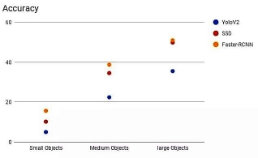

Figure 2.4: Accuracy of three algorithms SSD, YOLO and faster RCNNs on different sizes of objects. Results show that For small object size , performance of Faster RCNN’s is better htan other two, as size increases SSD accuracy and Faster RCNN accuracy become comparable

2.3.1 Faster R-CNN

Faster R-CNN is a type of regional proposal network. These network are fully convolu- tional. The reason for there high detection speed is that they are simultaneously able to classify object as well as predict the bounding region , that is simultaneous classification and localisation.

The network instead of using sliding window kind of approach over whole image first segments the image into region of interests , that is placing bounding boxes over region with chances of having an object. For example , the figure 2.4 , network passes the image to a segmenting network , that returns blobs in image , these cyan blobs are regions where thee are chances of findingobjects , so bounding box covering the region is given as output , simultaneously network tries to classify the bounded region. The segmentation highly reduces the number of regions that needs to recognised . This forms basic idea behind Re- gional proposal methods. But these algorithms are slow. To increase speed, Fast RCNN

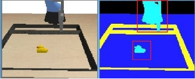

Figure 2.5: Visual representation to get a working intuition of faster RCNN. The algorithm simultaneously masks out regions of interests and runs object classificationon those region to detect objects.

was proposed. Original Regional proposal method, classifies each region one at a time , fast RCNN implement convolution for simultaneous predictions, approach similar to slid- ing window approach.A further improvement was made on fast RCNN, as the clustering or segmenting process of Regional proposal and also Fast RCNN was slow , so Faster RCNN was proposed.The previous algorithms used traditional methods for masking or producing segments, Faster RCNN used CNN for the purpose of segmentation too. This highly in- creasedthespeedofentirealgorithms. Asnotedin[\[4\]](#_page57_x0.00_y792.00)thetraditionalregionalmethodssaw around 25X Faster speed due to introduction of Fast RCNN, and Faster RCNN increased the detection speed further 10X, that is 250X traditional regional proposal method. Still (above citation)shows that Faster RCNN are around 3X slower than most recent YOLOv4. Deep CNNs such as VGG Network or Resnet were used as backbone for Faster RCNN, that is part on network responsible for feature extraction. The Faster RCNN model used in

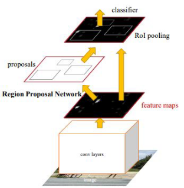

Figure 2.6: The backbone of faster RCNN are feature extraction convolution layers, based on deep neural networks such as ResNet. The extraction of features is followed by two simultaneous calculations of masking of region proposals , that is area of interest in image with highest probabilities of having objects based on feature concentration and classifica- tion of object

project uses ResNet50 as its backbone, pre-trained on COCO dataset.

1. ResNet

All classification and detection algorithms heavily rely on extraction of features, from im- age for classification purposes. A fundamental theorem in deep learning, the universal approximation theorem states that any function can be approximated, and a single feed for- ward layer can be sufficient for approximating any function , but this is not the case , as shallow networks are prone to early saturation. General trend being , the deeper the net- work , more chances are there to extract better features. As seen in with AlexNet , VGG followed by GoogleNet , having 5 , 19 and 22 convolutional layers. But Deeper networks face there problem of there own , the problem of vanishing gradients. As gradient becomes small , back propagation means multiplication with similar smaller gradients , and as net- work depth increases , the gradient may eventually saturates to zero. This factor highly limits depth of [CNN.reference\[5\]](#_page57_x0.00_y792.00) To Avoid the problem of gradient vanishing , ResNet uses a method called shortcut connections or identity shortcut connections. Say the input after activation that is fed forward is given by the function F (x), shortcut connections add

Figure 2.7: (results from ResNet paper arXi[v:1512.03385v1)\[5\]](#_page57_x0.00_y792.00) As Neural nets get deeper and deeper , both training and testing error increase dramatically , due to problem of gradi- ent vanishing , figureshows error comparison of 26 layer and 56 layer model

(x) to activated input to give H(x) = F (x) + x. Now while back propagating , the gra- dient of function F (x) may suppress to zero , but gradient of H(x) = F (x) + x will still maintain identity value, thus creating an identity mapping layer. Thus even in worst case scenario gradient propagation is not lost , and so the chances that deeper layers may be able to learn something useful increases. Thus making it possible to increase total depth of the network.

Figure 2.8: from ResNet paper arXiv:1512.03385v1),Direct connections of input layer to output of activated layer forms an identical mapping and comes to aid when dealing with problem of vanishing gradient. If back propagation of gradient in the layer causes gradient of activation layer to saturate to zero , gradient of identical mapping approaches value of 1 and helps prevent vanishing of gradient during back propagation

This allows ResNet to extend depth upto 152 layers. For project purposes ResNet50 , ResNet with 50 layers is used.

2. Evaluation of object detection models

In classificationproblems confusion matrix is used to evaluate a model, but detection prob- lems also deal with problem of localisation or pin pointing the location of object, which

Figure 2.9: IOU or Intersection over Union of two boxes is a method to calculate precision of object detection algorithms. Red being predicted box and green being true bounding box. Area common to both is termed as intersection and total area covered by overlapped boxes is termed as union , there ratio, is used as grading metric for detection algorithms. With IOU being 1 means 100 percent detection precision

also needs to be evaluated. To deal with the two, a simultaneous evaluation method is used called mAP or mean Average Precision. Just like an object classification algorithm uses confusion matrix for prediction of object based on probabilities of each class, detection algorithms use an idea called IOU , intersection over union an a metric for degree of preci- sion. IOU is ratio of intersecting area of true and predicted ground boxes to area of union of two boxes. This IOU is used as boundary for classifying an object for positive or negative for a class. A confusion table containing cumulative true positives , true negatives , false positives and false negatives is made , for getting precision to recall distribution. The area under the precision recall distribution gives mean average precision of object detector or termed as mAP evaluation.

3. Transfer learning

In layman terms transfer Learning is a powerful technique of implementing models trained on for certain task , to implement them on different but similar task. For the purpose of this project, a pre-trained Faster RCNN model based on ResNet-50 was implemented , pre-trained weights on COCO data set , having 330,000 images of 80 different classes of everyday item were used. Training this on a desktop with limited computing power would take from several hours to few days.

But using transfer learning approach , a small set of about 40-50 images of a particular class of object can be used to selectively train the network, within matters of few minutes. For project purpose , a set of 40 images each of rubber ducks and balls are used to detect these two classes. Effectively reducing training time to few minutes.

Chapter 3

Simulation Requirements and Setup

1. Pybullet

Pybullet provides a clear and simple API for accessing Bullet physics engine. It also pro- vide users with a brief guide for tapping into features of Bullet engine [\[6\].](#_page57_x0.00_y792.00) Pybullet allows users to load URDF filesalong with support for formats of other platforms such as Gazebo SDF , MujoCo MJCF , along with other supporting tools such as inverse kinematic solver and visualisation tools. It also provides with pre existing models. Apart from an GUI that simulates an interactive environment ,setting up camera with depth sensors is very simple. Following steps can be followed to set up pybullet. Pybullet has an excellent advantage over gazebo that it is cross platform. For this project ,windows platform is used.

1. To set up Pybullet on system , make sure system has python 2 or python 3 is installed , though python 3 and above are preferred. Python in system used for this project uses python 3.6.
1. Use command pip install pybullet on a python enabled command shell. This is all require to use pybullet on system.
1. But to get access to examples and existing object and robotic models, go to https : ==github:com=bulletphysics=bullet3 clone the repository or download the zip. and unzip in any suitable directory of system.
1. All existing models and few examples for understanding pybullet can be found un- der "pybullet env" folder and "pybullet data" folder pybullet\_envs=examples. This completes setting up pybullet
2. Machine learning libraries

After setting up pybullet for simulation ,next step is setting up python libraries for machine learning algorithms.

1. Tensorflow

Tensorflow is a machine learning library , open source and free to use. tensor flow provides both cpu and gpu supports. For gpu support CUDA must be installed from Nvidia official source separately. For the project purposes Tensorflow 2.3 along with CUDA versios 11.1 is used. For installation and set up refer to tensorflow [documentation\[7\].](#_page57_x0.00_y792.00)

2. Pytorch

Pytorch is also a machine earning library like tensorflow. It is also free to use and open source under a modifiedBSD licence. Pytorch is more user friendly for beginner use. And either or both libraries can be used for this project. Pytorch is used because it provided with pre trained models under pytorch zoo collections. To install and setup pytorch refer [documentation\[8\]](#_page57_x0.00_y792.00) and use the command as per system requirements.

3. Object detection Libraries

Apart from machine learning libraries, object detection requires some additional setup. There are two ways to implement object detection. In order to observe true capabilities of pre trained algorithms, Tensorflow object detection API should be used, as pytorch has implemented an API for ease of use that though simplifiesthe process, but slightly reduces speed. In this project pytorch is used to implement object detection models, for sake of simplicity.

1. Tensorflow Object detection API

Tensorflow Object detection API is built upon tensorflow for fast and easy deployment of object detection modules. It provides direct interface on controlling and configuring GPU usage for fast and efficient training and testing of modules. For setup and details please refer documentation [\[9\]](#_page57_x0.00_y792.00)

2. Pytorch Model Zoo

Pytorch provides methods to tap into Model Zoo , which is a collection of pre trained models, that are ready to be deployed or finetuned for more precise use. It has pre trained models for object recognition , detection , image translation and many [more\[10\].](#_page57_x0.00_y792.00)

3\.3.2.1 Detecto object detection API for pytorch

Detecto is a module built over pytorch that provides easy access to training a custom ob- ject detector using ResNet-50 based Faster R-CNN. Apart from just configuring a custom detector , it provides some wrapper functions from openCV python such as image visuali- sation, reading and visualisation of video files. to install detecto on system, use command this on shell pip install detecto. For further information on detecto [click ](https://detecto.readthedocs.io/en/latest/)[here\[11\]](#_page58_x0.00_y792.00)

4. LabelImg

Figure 3.1: Software helps fast generating data for object detection algorithms. Open the directory with collection of images, mark the bounding box around target object and label the object. This simple cycle generates a ".xml" filecontaining labels and XY coordinates of bounding boxes.

LabelImg is free to use software based on python, for generating samples for object detection and classification. It can generate label in different formats suitable for different platforms. For project, image samples for bound box predictions were generated using LabelImg.

1. To use labelImg install using pip with this command on shell - pip install labelimg.
1. Now open LabelImg, click on open directory and select folder with sample images.
1. click on change save directory to select same folder again to save label files.
1. Labeltheimageorboundwithboxestogeneratelabelfilewith.xmlextension, which can be changed as per requirement. That’s all there is to generate labeled data for object detection.
5. Setting up environment

With all libraries installed, this section will begin with how to set up simulation environ- ment. Setting up environment will take place in few Major steps:

1. Setting up environment requires few functions for getting observations, applying ac- tions and rewards and reset at completion of tasks. Before moving on there are few things that should be remembered while setting up an environment for reinforce- ment learning . First determine whether the task is episodic or non episodic. An episodic task is a task with an end state, for a non episodic task, task goes on forever without end. Episodic tasks do not consider past actions in account for determining future actions. Game of chess is a non episodic task , where as the current project ,maneuvering a robotic arm is an episodic task .This is important because it helps determine reset scheme, every episodic tasks needs a reset scheme. As episodic tasks are independent of past states there reset can be any random state.
1. Loading URDF models in pybullet environment. Along with kuka iiwa model, table , tray and objects such as toy duck and ball are re-spawned in the environment. Except for toy duck and ball, all other objects are kept at original model scale.
1. A reset function is required to reset the entire environment states to a random value. This means just two things setting random joint positions of articulated robot and respawning objects at random location with random sizes.
4. Next defining inputs and outputs to the environment. Inputs will be defined in next section. There are three outputs from every environment.State , reward and termina- tion flag. States are definedon based on criteria that is used to train. For this project, for reinforcement model learning , distance is used as a training metric, and this is what we will call state. That too there are are three options , using Euler distance , Manhattan distance or vector displacement. For image based reinforcement learning, state can be image an image. Rewards are defined keeping in mind the aim of the task. In this simulation reducing distance gives reward and increasing distance gives a penalty. Last is termination flag. This flag marks the achievement of end goal. If goal is achieved termination flag is 1 else 0. Next is setting up the Agent , that is , articulated robot.

3\.5.1 Articulated robot model - Kuka iiwa

Kuka iiwa 7 is a model with 14 links as per URDF file and 7 joints in the main body, not counting the joints in the extension of the end-effector , that is gripper. Kuka model is accompanied by a script describing its motion, taking step size and direction in Cartesian coordinates as inputs and using inverse kinematics implementation provided by pybullet, calculating joint rotations. As the implementation of this inverse kinematic algorithm is in a open loop system, that is no feedback is given back to system to correct joint positions and so certain errors are prone to happen. So in order to measure this error, instead of measuring error of joint angles, error within finalobjective is measured, that is calculating net deviation of the end effector from its expected path. And only control that one has on the definedKuka model is definingits step size. With all parameters already been provided for simulation, selecting the step size is most crucial part. Below plots give an idea on how to select an effective step size. For selecting step size, apart from error another thing to remember is that smaller the step size , slower is the motion. Another point is that more error to step ratio, more will be accumulation of error within fixed distance. The plots start at step size of 0.0001 units and stop at 0.01. Error Values are taken in average absolute over 50 iterations of 10 steps each, to get mean absolute difference.

It is clearly visible lower graph that error to step size ratio is least for 0.001 step size. From figureerror vs step size, a clear trend shows that lower step size gives lower absolute error, but there is negligible difference between 0.001 and 0.0001 step sizes. So keeping in mind speed factor , 0.001 is used as preferred step size for simulation.

1. First stem is fixingthe step size, dv , fixed as stated above.

   

Figure 3.2: Selection of step size is crucial in reducing error. As the step size increase it is observed that magnitude of error also increases , whereas as second graph shows the relative error size compared to step size. this is important as accumulation of small errors can result in large error , and so step size with smallest relative error is selected , that is step size 0.001

2. Next step requires defining action space of model. The input to predefined model is an action array corresponding

   [X(motion);Y(motion);Z(motion);Y aw(endeffector);grip(angle)] , say for ex- ample to move a step in x and y direction and rotate end effector by =4 rads and open grip by =3 rads , input is given as [dv;dv;0;=4;=3]. It is to be noted that this action space is continuous. For ease of use and having a fixed finite action space , the action space is reduced to 6 actions. ["stop";"left";"right";"down";"forward";"backward";"up"] These actions are defined for picking task , and new action can be described at any time as per condi- tions. But for training purposes these functions are used.

3. A single episode consists of 50 steps , providing enough time for arm to reach from one end to another in 40 steps and extra 10 steps. After completion of 50 steps the arm is closed and lifted up.
3. Informationofendeffectororientationandpositionisprovidedbyforwardkinematic function implemented in kuka module. So at every step the this calculated value is used to get the orientation and position in space.

After following all these steps, environment is ready for training.

Chapter 4

Implementation and Results

As stated earlier, this experiment is implemented in different pieces as components of a single pipeline, and so the the results are also discussed separately for each pipeline then whole system together.

1. Maneuvering with Reinforcement Learning

The firstpart of pipeline is training the articulated robot to maneuver itself and to reach the target object position. Following the algorithm [2.1] , a deep neural network (Q(s,a)) with following specificationsis modeled.

Table4.1: LayerarchitectureofDeepqnetworkused. UnliketraditionaltabularQlearning algorithm that uses table to capture environment model by keeping a record of every state and there corresponding action values , Deep Q network uses a deep neural network to approximate this table as a function mapping all uncountable states to there corresponding action values or Q values. The following net in simulation has 3 hidden layers with tanh activation

|Layer|Nodes|Activation|
| - | - | - |
|input|2|linear|
| - | - | - |
|hidden|10|tanh|
|hidden|10|tanh|
|hidden|10|tanh|
|output|6|linear|

Reward scheme is designed to reduce distance between end effector and the object.

|Algorithm 4.1: Environment Reward scheme|
| - |
|
1 dt0 = distance before action

2 dt1 = distance after action

3 if dt1 < dt0 reward = 0.1 + exp (dt1) 4 else reward = - 0.2
|

1. Results

Below are the training loss and episodes rewards per episodes. Training stopped with average reward saturation with patience of 25 episodes. Trained on small object toy duck.

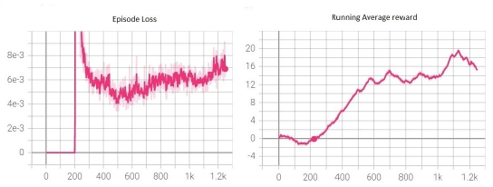

Figure 4.1: Reinforcement algorithms train by generating there own data samples by ex- ploration and train on them , but training for very longer periods of time can overload states and so performance diminishes and so loss increases and rewards per episodes start to decrease. To counter this training is stopped at episode when maximum episodic reward start to saturate. For the simulation purposes , reward saturates at 18 points and training is stopped with patience of 25 episodes.

Deep Q learning gave excellent simulation results. As expected Model works with 97 out of 100 hits, that is picking up randomly positioned objects 97 out of 100 times. These results are pretty convincing and work in favour of using reinforcement learning for maneuvering the articulated arm. A still from simulation result progress can be observed below image.

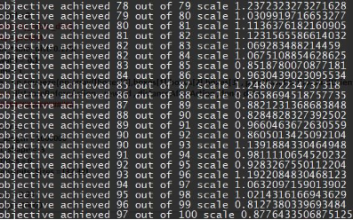

Figure 4.2: A still from simulation results , as only metric to characterise efficiency of algorithm is to observe if goal is achieved or not

2. Range of objects

To test how compatible position based Deep q algorithm is five different types of objects are tried, toy duck , ball , plate , pan and cube. With 20 episodes each.

3. Results

Table 4.2: To test gripping efficiency with respect to shape of object of articulated arm , different objects where placed on simulation and number of times the arm could pickup an object is used to criticize efficiency based on object shape

|Object|Pass out of 20|
| - | - |
|toy duck|20|
| - | - |
|sphere|19|
|Cube|20|
|plate|6|
|pan|3|

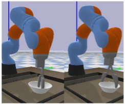

Figure 4.3: fails to pickup plate

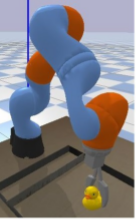

Figure 4.4: Easily picks up duck

The results show that shape of object affects picking action. Small shapes with volumi- nous body , such as ball and cube are easy to pick. For rest simulations were trained using toy duck and ball object.

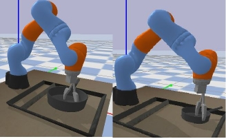

Figure 4.5: fails to pickup pan

2. Object detection

Thesecondpartofpipelineinvolvesobjectdetectionandclassification. Asstatedinchapter 3, object detection is implementation of ResNet based faster RCNN using Detecto api.

1. A data set of images from environment are collected, Two objects are used for detec- tion purposes, two objects are targeted, toy duck and a ball. 85 images of each are taken from the environment and are split into two data set of 120:30:20 for training, testing and validation.
1. Now before training, its crucial to understand how transfer learning works. Transfer learning follows a simple idea , stripping away outer most layer that is responsible for classificationbased on original data , in this case COCO data set , and creating a new layer with new classes probabilities. In this case the two classes are "balls" and "rubber duck".Now the model uses all previously learned features but uses them to classify new class of objects. Now the new data set , of 120 images is used to train the weights for outermost classification layer. Rest all weights remain unchanged. This enables fast learning on small data sets , with high results.
1. After training the algorithm, testing is required. Analysis of object detection algo- rithms require mAP estimate.

4\.2.1 Results

It is clearly observed that loss settles very quickly over a small trainig dataset of just 120 images.

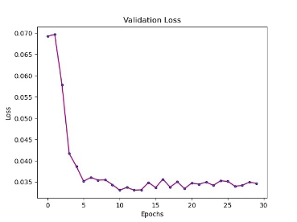

Figure 4.6: Validation Loss during transfeer learning

mAP Evaluation

Figure 4.7: mAP estimation given by area under precision, recall curve , mAP = 0.963 , IOU > 0.8

" # " # " # TP FN 17 0 19 0

Confusion matrix for toy duck for ball .

FP TN 0 19 1 17

mAP Evaluation of 0.96 for an IOU of 0.8 is a good score. Though it is to be noted that evaluation is done on a very small test data of 30 images. Also average speed of detec- tion is 0.27 ms. The following plots of mAP estimations for different IOUs can be used to characterise detection algorithm while comparing with any other detection model in future.

Figure 4.8: mAP estimates help in evaluating different models for same IOU curves. The closer the area of curve to 1 , better the detection algorithm.

Below images show detection results on hurdled objects.

Figure 4.9: Real time detection on two instances, with objects being clustered together and occlusion created by gripper , yet detector able to classify objects with classification probability threshold > 0.95 and IOU threshold > 0.8

3. Object Position determination

Output from detection module , that is coordinates of detection boxes are used as input to a feed forward neural network with Mean squared error loss function. A data set of 4000

points is generated by using object detection algorithm to get [X(upperleft);Y(upperleft);X(LowerRight);Y(LowerRight)] as inputs and object true [X;Y]coordinates as target. Using [X(upperleft);Y(upperleft);X(LowerRight);Y(LowerRight)] Model gives a prediction of object [X;Y]coordinates

Table 4.3: Model with 2 hidden layers with Relu as activation function and mean squared loss function , Model architecture to approximate functional relation between bounding box pixel coordinates to real world Cartesian Coordinates

|Layer|Nodes|Activation|
| - | - | - |
|input|4|linear|
| - | - | - |
|hidden|6|relu|
|hidden|10|relu|
|output|2|linear|

Figure 4.10: Validation loss approaches 0.0132 and test loss approaching 0.0107 , with train , test validation split of 0.4, 0.4 , 0.2 respectively

Figure 4.11: Validation accuracy approaches 0.983 and test accuracy approaching 0.937, with train , test validation split of 0.4, 0.4 0.2 respectively

Figure 4.12: To understand the degree of deviations between predictions of model and true coordinates of object , following distribution show degree of deviations of 1600 points , It is seen that majority of error is within magnitude of 0.02 units

The difference between prediction values and truth values of coordinates are depicted in the graph figure [4.12]. The graphs help us visualise the error in predicted coordinates. it can be seen that majority deviation is about 0.02 units. The model gives decent result with a margin of 20 percent error.

Just to get an Idea of error Figure [4.13] gives a measure of 0.1 units in environment as compared to 0.001 step size of robot.

Figure 4.13: An idea of sizes in simulation

4. Results of Complete pipeline

Output are X, Y coordinates. These coordinates are fed to neural network to complete the pipeline.

The complete model picks objects 85 out of 100 times. The results declined due to error induced by position prediction model. The figure below is a snap shot from simulation results.

Figure 4.14: The image shows number of episodes where goal is achieved corresponding to total number of episodes and size of targeted object. 85 out of 100 times articulated arm was able to pick up the detected object, with an average step time required of 3.337 ms

The results were quite a success and can be used as stepping stones to further increase efficiency of the model and decrease reaction time of the Articulated robot and further increase efficiency of detecting and picking up object above 85 percent.

Chapter 5

Conclusion and Future scope

1. Conclusion
1. The current model is able to perform the most rudimentary task of selecting and picking up an object quite convincingly. Though speed of whole process is slow , still approach shows promising results. The model is far from perfect and nowhere near to human dexterity. Still the results show promising results that need to be improved upon.
1. Beginning from the first part of whole pipe line articulate robot maneuvering using Deep-q using only distance as a training metric though shows good results. Using minimum distance as training parameter performs the task convincingly but it is no surprise that the model fails in determining orientation of the selected object , effec- tively compromising on gripping action. Another similar factor being orientation of the end effector, the model must determine orientation during approach for a better grip.
1. Current model for articulated robot used , uses open loop inverse kinematics, which highly reduces the step size making the a single step tediously slow. More efficient control schemes need to be implemented. Or another way to look into this problem is by directly training a reinforcement learning model using joint states, instead of using a predefined action space. This approach may show good results as it will directly eliminate the problem of step size , that is essential in defining action space for the arm , and speed up the whole process. The problem of fixed defined action does not include changing orientation of end effector. This fixes the orientation of the articulated arm end effector.
4. A new approach considering orientations of both end effector and object needs to be implemented. Picking from top approach works pretty good as seen from results but we have to consider the type of objects used in simulations have dimensions that

Figure 5.1: Direction of approach is always fixed, that is approach from top , irrespective of orientation of object , this becomes source of problem for objects with variations in different dimensions such as a long object , like a rod or a flatobject like plate or pan

perfectly fitwithin grip of end effector when it approaches objects from top without considering orientations , but it will no doubt fail in picking up flatobjects such as a book, or a plate or any object that extends in single dimension such as a pencil or a pen or a pipe or any object that require a particular orientation of the end effector.

5. For object detection and classification, though mAP evaluation is promising (though tested on small data set ), A more faster approach is required. Current model using faster R-CNN takes roughly 300 ms for detecting object, as stated in fundamentals section this is roughly 20 times slower than current state of the art algorithms such as YOLOv4 and SSD MobileNet.
5. Anotherrobustboxtopositionmappingschemeisrequired,otherthanusinganeural network for mapping. Current method highly relies on camera orientations, and thus highly reduce the ease of re-usability in a different setup. More robust approach needs to be worked out.
5. One most important part that needs to be added to the pipeline is object tracking. Current model heavily relies on distance as matrix for picking up or selecting any object. In fact while selecting from multiple objects only criteria used is the distance

Figure 5.2: End effector always approaches from top direction , irrespective of pose and orientation of object.

between object and end effector. It is able to categorise different classes of objects, Yet fails to different objects of same class. For example as seen it can differentiate between rubber duck and ball , but it is unable to differentiate between two identical rubber ducks. It lags the Idea of tagging an object over next image frame. Every image is seen as a new set of objects , unrelated to previous frame.

2. Future Work
1. Future work includes, increasing speed of model. Both step size and Faster RCNN prediction time are major factors. As stated, eliminating need of an step dependent actionspacebyusingjointpositionsasinputtoreinforcementmodellookspromising andishighlylikelytobealreadyexploredandtested. Suchapproachneedstofigured out and test as soon as possible.
1. As stated implementation of current state of the art object detection algorithms such as Yolov4 and SSD networks need to tested, as per literature on these algorithms , they are expected to work atleast ten times the current detection speed.This will directly aid at reaction time of the robot.
3. As stated currently pose and orientation of both end effector and object are ne- glected.Pose estimation algorithms need to be incorporated to increase diversity of objects that can be handled.
3. Another important step that requires immediate attention is using current state of the art object detection and tracking algorithms. For object tracking, ROLO algorithm that is Recurrent YOLO algorithm, that exploits temporal relations between succes- sive image frames using LSTM to track objects is one of prominent idea in the field. Theapproachneedstobetestedandimplementedforeliminatingtheproblemcaused by identical objects and object tagging.

Bibliography

1. Priyanshu0402, “Priyanshu0402/realtime-object-detection-for-robotic- armapplications.” [Online]. Available: [https://github.com/Priyanshu0402/ Realtime-Object-Detection-for-Robotic-ArmApplications](https://github.com/Priyanshu0402/Realtime-Object-Detection-for-Robotic-ArmApplications)
1. S. H. Burton, “Coping with the curse of dimensionality by combining linear programming and reinforcement learning.” [Online]. Available: [https: //digitalcommons.usu.edu/etd/559/](https://digitalcommons.usu.edu/etd/559/)
1. W. Liu, D. Anguelov, D. Erhan, C. Szegedy, S. Reed, C.-Y. Fu, and A. C. Berg, “Ssd: Single shot multibox detector,” Lecture Notes in Computer Science, p. 21–37, 2016. [Online]. Available:[ http://dx.doi.org/10.1007/978-3-319-46448-0_2](http://dx.doi.org/10.1007/978-3-319-46448-0_2)
1. J.-a. Kim, J.-Y. Sung, and S.-h. Park, “Comparison of faster-rcnn, yolo, and ssd for real-time vehicle type recognition,” in 2020 IEEE International Conference on Con- sumer Electronics - Asia (ICCE-Asia), 2020, pp. 1–4.
1. K. He, X. Zhang, S. Ren, and J. Sun, “Deep residual learning for image recognition,” 2015.
1. UserManual.wiki, “Pybullet quickstart guide.” [Online]. Available: [https:// usermanual.wiki/Document/pybullet20quickstart20guide.479068914/html](https://usermanual.wiki/Document/pybullet20quickstart20guide.479068914/html)
1. “Gpu support : Tensorflow.” [Online]. Available: [https://www.tensorflow.org/install/ gpu](https://www.tensorflow.org/install/gpu)
1. [Online]. Available:[ https://pytorch.org/](https://pytorch.org/)
1. “Tensorflow 2 object detection api tutorial¶.” [Online]. Available: [https: //tensorflow-object-detection-api-tutorial.readthedocs.io/en/latest/](https://tensorflow-object-detection-api-tutorial.readthedocs.io/en/latest/)
1. [Online]. Available:[ https://modelzoo.co/](https://modelzoo.co/)

41

11. “Welcome to detecto’s documentation!¶.” [Online]. Available: [https://detecto. readthedocs.io/en/latest/](https://detecto.readthedocs.io/en/latest/)

Appendix A

Appendix A Title

A.1 Object detection , detecto API implementation

from detecto import core, utils, visualize import time

import matplotlib.pyplot as plt

import os os.environ["CUDA\_VISIBLE\_DEVICES"]="0"

import torch

import cv2

import numpy as np

from detecto.visualize import show\_labeled\_image

Ap = []

p = 0

r = 0

total\_objects = 0

def IOU(boxA, boxB):

- determine the (x, y)-coordinates of the intersection rectangle xA = max(boxA[0], boxB[0])

  yA = max(boxA[1], boxB[1])

  xB = min(boxA[2], boxB[2])

  yB = min(boxA[3], boxB[3])

- compute the area of intersection rectangle

interArea = max(0, xB - xA + 1) \* max(0, yB - yA + 1)

- compute the area of both the prediction and ground-truth
- rectangles

boxAArea = (boxA[2] - boxA[0] + 1) \* (boxA[3] - boxA[1] + 1) boxBArea = (boxB[2] - boxB[0] + 1) \* (boxB[3] - boxB[1] + 1)

- compute the intersection over union by taking the intersection
- area and dividing it by the sum of prediction + ground-truth
- areas - the interesection area

iou = interArea / float(boxAArea + boxBArea - interArea)

- return the intersection over union value

return iou

print(torch.cuda.is\_available())

device = torch.device("cuda:0" if torch.cuda.is\_available() else "cpu") print(torch.cuda.get\_device\_name(0))

model = core.Model()

#labels, boxes, scores = model.predict\_top(image) #visualize.show\_labeled\_image(image, boxes, labels)

dataset = core.Dataset(’mixduckball/’) print(type(dataset))

datatest = core.Dataset(’mixduckball/testball/’)

val\_dataset = core.Dataset(’mixduckball/testball/’)

#image, targets = datatest[0]

#show\_labeled\_image(image, targets[’boxes’], targets[’labels’])

model = core.Model([’rubberduck’,’ball’] , device = "cuda:0") loss = (model.fit(dataset,val\_dataset,verbose=True,epochs = 30)) plt.plot(loss)

plt.show()

#losses = model.fit(dataset,verbose=True,epochs = 30) model.save(’xmlread\_mixduckball\_smalldata.pth’) #model.save(’model\_weights\_rubberduck.pth.pth’)

A.2 Position detection model implementation

import tensorflow as tf

import numpy as np

import matplotlib.pyplot as plt

physical\_devices = tf.config.list\_physical\_devices(’GPU’)

try:

tf.config.experimental.set\_memory\_growth(physical\_devices[0], True) except:

- Invalid device or cannot modify virtual devices once initialized. pass

#data\_raw = np.genfromtxt(’position2\_99.csv’, delimiter=’,’)

\## image size input 360x360 , rescale images to the said dimensions

data\_raw = np.genfromtxt(’position\_final5.csv’, delimiter=’,’) mean = np.mean(data\_raw , axis = 0)

std= np.std(data\_raw , axis = 0)

mean\_ip = mean[:4]

std\_ip = std[:4]

mean\_op = mean[4:]

std\_op = std[4:]

data\_whole = (data\_raw - mean)/ std

test\_ratio = 0.1#0.05

test\_size = int(test\_ratio\*len(data\_whole))

test\_index = np.random.choice(len(data\_whole),test\_size, replace = False ) data\_test = data\_whole[test\_index]

data\_train\_preval = np.delete(data\_whole , test\_index , axis = 0)

val\_ratio = 0.1

val\_size = int(val\_ratio\*len(data\_train\_preval))

val\_index = np.random.choice(len(data\_train\_preval),val\_size, replace = False )

data\_val = data\_train\_preval[val\_index]

data\_train = np.delete(data\_train\_preval , val\_index , axis = 0)

#ip\_data = (data\_train[ :, [0,1]] + data\_train[ :, [2,3]])/2 #ip\_data\_test = (data\_test[ :, [0,1]] + data\_test[ :, [2,3]])/2 #ip\_data\_val = (data\_val[ :, [0,1]] + data\_val[ :, [2,3]])/2 ip\_data = data\_train[ :, [0,1,2,3]]

ip\_data\_test = data\_test[ :, [0,1,2,3]]

ip\_data\_val = data\_val[ :, [0,1,2,3]]

inp\_shape = ip\_data.shape[1]

op\_data = data\_train[ :,4: ] op\_data\_test = data\_test[ :,4: ] op\_data\_val = data\_val[ :,4: ]

model2 = tf.keras.models.Sequential([ tf.keras.layers.Input(shape=inp\_shape), tf.keras.layers.Dense(6, activation=’relu’, kernel\_initializer=’GlorotNormal’), tf.keras.layers.Dense(10, activation= ’relu’ ,kernel\_initializer=’GlorotNormal’), #tf.keras.layers.Dropout(0.2), #tf.keras.layers.Dropout(0.2), tf.keras.layers.Dense(6, activation=’relu’

,kernel\_initializer=’GlorotNormal’),

tf.keras.layers.Dense(2 )

])

47

optim = tf.keras.optimizers.Adam(learning\_rate=0.00005,

beta\_1=0.9, beta\_2=0.999, epsilon=1e-07, amsgrad=False,name=’Adam’)

model2.compile(optimizer=optim,#’adam’,

loss=’huber\_loss’, metrics=[’accuracy’])

epoch = 800

history = model2.fit(ip\_data , op\_data , epochs = epoch,

validation\_data=(ip\_data\_val, op\_data\_val),batch\_size=128,verbose=0)

print(history.history.keys())

plt.plot(history.history[’accuracy’]) plt.plot(history.history[’val\_accuracy’]) plt.title(’model accuracy’) plt.ylabel(’accuracy’)

plt.xlabel(’epoch’)

plt.legend([’train’, ’test’], loc=’upper left’) plt.show()

plt.plot(history.history[’loss’]) plt.plot(history.history[’val\_loss’]) plt.title(’model loss’)

plt.ylabel(’loss’)

plt.xlabel(’epoch’)

plt.legend([’train’, ’test’], loc=’upper left’) plt.show()

Title

ORIGINALITY REPORT

1SIMILA%RITY INDEX 1INTE%RNET SOURCES 0PUB%LICATIONS %STUDENT PAPERS

PRIMARY SOURCES

1  dIntiegrnitetaSlocuorcme mons.bryant.edu <1%
1  sInctehrnoetlSaorusrcme ine.mst.edu <1%
1  "SCcoiemncpeutaenrdVBisuiosnine–sEsCMCVed2i0a1L6L"C, ,S2p0ri1n6ger <1% 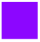Publication
1  CIntleirnneict SaoluTrcreials.gov <1%
1  lInuteprn.elut Sbou.rlcue.se <1%
1  wIntewrnwet .Smourdcepi.com <1%

Exclude quotes On Exclude matches < 10 words Exclude bibliography On

